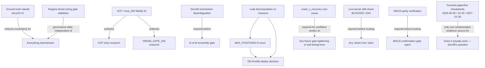

# Doc 43 — Research Director Audit & Queue

**Date**: 2026-07-31
**Role**: Standing Research Director audit, per `CLAUDE.md`. Source of truth: `docs/41_Architecture_Map.md` (what's built) + `docs/42_Research_State_Registry.md` (what's been tested/decided). This doc does not propose or implement any new trading feature — it audits, challenges, maps dependencies, and queues.

## 0. Scoring methodology — read before the tables

Two different kinds of claim are mixed together in this audit and they are scored differently:

- **Groundable axes** — Engineering Effort, Dependencies, Blocked/Not-Blocked — are derived directly from `docs/41`'s call-chain map (a config-flag flip is knowable as cheap; a new backtest subsystem is knowable as expensive). These are stated as facts.
- **Speculative axes** — Expected Alpha / Expected Value, Research Confidence for anything not yet run — are guesses, not measurements. Per the charter ("never invent certainty... if evidence is weak, say I don't know"), these are given as a rationale or a range, never a false point-estimate. Where a cell says **Unknown**, that is the honest answer, not a placeholder.

This means the ranking in §9 is not "which idea sounds most profitable" — it is dominated by items that reduce uncertainty in the evidence base itself, because no new-alpha claim can currently be trusted more than the contaminated/stale evidence it would be measured against.

---

## 1. Open Item Audit

| Item | Priority | Difficulty | Expected Value | Dependencies | Eng. Effort | Research Confidence |
|---|---|---|---|---|---|---|
| **Ground-truth rebuild from Proven+Supported assumptions only** (docs/23 §XI ⭐) | **Critical** | Medium | High information value (re-baselines everything else); alpha impact unknown until run | None — ready now | ~2-3 days (rebuild config from the 8 Proven + 12 Supported items, run full gate) | High confidence this *should* be run; Unknown what it will show |
| **Re-measure docs/18-20 leak decomposition under current `PURE_RS` + 504-symbol config** | **Critical** | Low | High — diagnostic, not a new lever; directly informs whether the 27% idle-capital / 3.2pp friction numbers still hold | None — ready now | ~1 day (re-run the same leak-attribution scripts against current config) | High — this is a measurement, not a hypothesis |
| **`crash_v_recovery` root-cause diagnosis** | **Critical** | High | High — currently blocks confident accept/reject on *any* gate-tightening or exit-timing lever | None architecturally, but needs a dedicated multi-lever forensic pass | ~3-5 days | Unknown until done; 3-4 independent levers share this signature so a common mechanism is plausible |
| **VCP / `ema_200` backtest fidelity fix** | High | Medium | Unknown alpha impact — but currently makes `TREND_GATE_200_ENABLED` and all VCP-entry claims untestable | Blocks: any VCP or 200-EMA-gate research | ~2-3 days (wire `vcp_detected`/`vcp_pivot`/`ema_200` into `_precompute_all()`, re-verify via `live_backtest_parity_check.py`) | High confidence this is a real gap (docs/40 confirmed by direct code read) |
| **Regime-tiered sizing (`a731b5d`) — retroactive gate validation** | High | Low | Unknown — shipped without a gate run, could be a live process violation with real P&L exposure either way | None — ready now | ~0.5 day (run `robustness_gate.py` against the already-shipped config) | High confidence this must be done; this is a governance gap, not a research question |
| **MAX_POSITIONS=5 — clean rerun under current config + explicit reconciliation** | High | Low | Unknown — every prior test used a config that no longer exists (pre-`PURE_RS`, pre-Nifty500-expansion, pre-charges-fix) | Should follow the leak-decomposition re-measure (slot scarcity dynamics interact directly with position count) | ~1 day | Low confidence in any of the 4 existing contradictory results as still-applicable; needs a fresh run, not a literature reconciliation |
| **Live-server drift / dry-run check** | High | Low (blocked, not hard) | High — cannot currently confirm deployed code matches local `PURE_RS` default (prior incident: server ran a stale 50%-vs-claimed-40% config for weeks) | Blocked on SSH access (`Permission denied (publickey)`) — an ops task, not a research one | ~0.5 day once unblocked | N/A — this is a verification task, not a hypothesis |
| **DD-throttle removal — deploy decision** | Medium | Low | Passed the gate once (TRAIN CAGR +13.44%→+17.98%) under a config that no longer exists — should be re-validated under current config before deploying, not deployed on stale evidence | Depends on the leak-decomposition re-measure and ideally the MAX_POSITIONS rerun (both touch capital utilization) | ~0.5 day to re-gate, then a decision | Medium — direction was previously clean, but evidence is stale |
| **20%-drawdown kill-switch implementation** | Medium | Low | Not a research question — already decided (doc/39), just not built | None | ~1 day (wire into `daily_runner.py` / `PortfolioManager`) | N/A |
| **N-of-M ensemble entry gate** (FULL vs PURE_RS regime tradeoff) | Medium | Medium-High | Unknown — motivated by doc/38's finding that FULL wins in stress scenarios but loses on calendar TRAIN/TEST | Depends on disambiguating docs/40's momentum-maturity vs. mean-reversion mechanism first — building an ensemble on top of an unexplained effect is premature | ~1 week design+build, after the mechanism study | Low until the mechanism study lands |
| **Doc/40 mechanism disambiguation** (momentum-maturity vs. mean-reversion) | Medium | Medium | High information value for any future entry-gate work; not itself a new lever | VCP fidelity fix not required (this is about the existing breakout/trend gate, not VCP) | ~1-2 days (e.g. compare forward returns of FULL-admitted names against a distance-matched control for "days since 20d high" to isolate the mean-reversion component) | Medium — a well-designed control experiment should be able to separate the two |
| **Out-of-domain (Microcap-250) rerun, sector-cap confound removed** | Medium | Low | Medium — the original mirror-image result (TRAIN good/TEST bad) is directionally important evidence but was confounded | None | ~0.5 day (fix the "Unknown" sector mapping, rerun) | Medium — confound is understood and fixable |
| **Idle-cash BULL-regime ETF parking (E2)** | Low-Medium | Medium | Unknown — never executed despite being flagged in 3 docs (18, 19, 21) | Should follow the leak re-measure (E1/E2 overlap) | ~2-3 days | Unknown |
| **GOLDBEES→cash ablation (E5)** | Low-Medium | Low | Unknown — flagged "high ROI, still pending" across 4 docs (16.6, 18, 19, 21), never run | None | ~1 day | Unknown — flagged repeatedly by past research but never substantiated with a number |
| **Entry-lag ablation (E4)** | Low | Medium | Low-Medium — original suggestive signal was t≈1.7, not significant | None | ~1-2 days | Low — weak prior signal |
| **Charges-model re-validation (E6)** | Low | Low | Low — largely closed by the 2026-07-22 charges bug fix (brokerage/STT), which was itself a form of E6 | None | ~0.5 day (confirm current model against a manual sample) | Medium — likely already substantially resolved, just not formally closed as "E6 done" |
| **Dead-code keep/delete decisions** (`portfolio/optimizer.py`, `risk/manager.py`, `strategy/stock_ranker.py`, `strategy/market_filter.py`, `broker/paper.py`) | Low | Low | None (maintainability only, no alpha impact) | None | ~1 day total (delete or document why kept) | N/A |
| **Sharpe methodology fix** (population vs. sample variance, `backtest/metrics.py` vs `walk_forward.py`) | Low | Low | None (correctness only — could shift reported Sharpe slightly, doesn't change accept/reject calls materially) | None | ~0.5 day | N/A |
| **Schema drift back-port** | Low | Low | None (maintainability) | None | ~0.5 day | N/A |
| **Forward paper/live checkpoints** (2026-08-30 / 10-30 / 2027-01-30) | Critical (passive) | N/A — calendar-gated | Highest possible — this is the only non-reused, non-contaminated evidence source the project has | None — already running, just needs time to pass | ~0 (already in motion) | N/A — waiting, not researching |

---

## 2. Accepted Conclusions — Challenged

### 2.1 "Entry signal beats random" (permutation test, p=0.024) — **HOLDS, re-examined and confirmed**

This is the project's one load-bearing proven pillar and it survives direct challenge. Two candidate contamination pathways were checked:

- **Universe survivorship bias reaching the permutation test**: the static-watchlist look-ahead (docs/13/14) affects the *symbol pool*, but the permutation test compares the real RS-ranking arm against 40 *randomly shuffled* rankings drawn from the **same** contaminated pool. Any survivorship inflation in the pool raises both the real arm's and the shuffled arms' returns roughly equally — it is a differential test, not an absolute-return test, so a pool-level bias does not manufacture the real-vs-shuffled gap. The gap specifically isolates *selection skill within the pool*, which is a narrower and more defensible claim than "this pool's absolute returns are trustworthy" (they are not, per doc/38).
- **Dynamic-universe "extras" mechanism** — doc/14 flagged this as unresolved and possibly look-ahead. Checked against memory (`universe_dynamic_extras_clarified_20260713`): the backtest engine **never reads the dynamic universe table at all** — this is a coverage gap (dynamically-discovered symbols are simply absent from every backtest, including the permutation test), not a look-ahead contamination pathway. This *reclassifies* doc/14's open concern from "look-ahead risk, unresolved" to "coverage gap, doesn't affect validity of past numbers." Worth noting for completeness in §42's open-items list.

**Conclusion**: the +9.6pp/yr selection-skill claim stands. It should not be re-litigated without a new contamination pathway that specifically and differentially favors the real ranking over the shuffled arms.

### 2.2 "Portfolio construction is the leak, not stock-picking" — **STALE, needs re-measurement, not rejection**

The leak decomposition (docs/18, 20 — 27% idle capital, 3.2pp/yr friction at 8.46x turnover, stranded-capital as leak #1) was measured under the **old configuration**: `ENTRY_MODE=FULL`, ~100-symbol watchlist, pre-charges-fix. Since then: `ENTRY_MODE` flipped to `PURE_RS` (doc/34, looser gate → more candidates qualify), the universe expanded to 504 symbols (Nifty 500, doc/34), and the charges model was fixed (~07-22, materially changed full-window CAGR by ~27pp per doc/38 Addendum 2). A looser entry gate on a 5x larger universe plausibly changes both slot-scarcity dynamics and turnover/churn substantially — in either direction. **This is not a case for demoting the underlying finding** (portfolio construction as the mechanism is still the best-supported explanation on record), but the specific numbers (27% idle, 3.2pp friction) should be treated as historical, not current, until re-measured. This is the #2 item in §1's audit.

### 2.3 "Exits/stops are clean, not a leak" — **Same staleness caveat as 2.2**

Same measurement-window problem: cleared under the old FULL/100-symbol config (docs/18, 20, 24). Not contradicted by anything since, but also not re-confirmed under current config. Lower priority to re-check than 2.2 since no evidence anywhere suggests exits became a problem — but flag it as "last verified under a config that no longer exists" rather than "currently verified."

### 2.4 `ENTRY_MODE=PURE_RS` accept/deploy (doc/34) — **Reclassify from "clean gate PASS" to "wins on calendar windows, loses to FULL on stress scenarios"**

Doc/34's original framing ("first entry-signal-level lever this project has cleared clean") is no longer the most accurate summary of the evidence. Doc/38 Addendum 2 found the original gate-PASS was measured **one day before** the charges-model fix and was never re-gated. Addendum 3's re-validation under current honest costs confirms PURE_RS still wins on the calendar TRAIN/TEST split, but **FULL is actually better in both trend-regime stress scenarios** (crash-recovery, sideways chop) — a hard AND-gate just can't distinguish "veto because of chop" from "veto because of a real trend break." The deploy decision (doc/39) to keep `PURE_RS` live is still reasonable — it's the better-tested option on the metric that matters most (calendar OOS) — but doc/34's original "clean PASS, no ambiguity" language overstates the current evidence. This is precisely the ambiguity that motivates the N-of-M ensemble idea in §1, and it should not be built until the doc/40 mechanism-disambiguation study runs first.

### 2.5 "Broad universe beats narrow" — **Holds, reinforced**

Two independent narrowing attempts under two different eras (older liquidity-floor tightening, pre-Nifty500; doc/36's top-50-turnover cap, post-Nifty500/PURE_RS) failed the same way. Unlike 2.2/2.3, this conclusion has actually been *re-tested* under the current config (doc/36, 2026-07-28) and still held (TEST CAGR +41.64%→-15.91%, 2 stress sign-flips) — so this is not stale, it's a confirmed-twice finding under two different regimes. No revisit warranted.

---

## 3. Rejected Experiments — Re-reviewed

| Experiment | Original reject | Test date (best known) | Implementation-bug risk | Verdict |
|---|---|---|---|---|
| **RSI threshold sweep** | Two-sided local optimum reject (docs/24, 27) | 2026-07-11 | **High and specific** — backtest's RSI used simple rolling mean vs. live's correct Wilder's-EMA smoothing until doc/33's fix on 2026-07-14 (avg diff -2.45, spikes to ~18 points). This sweep ran entirely through the broken formula. | **Recommend revisit.** Cleanest case in this audit — exact bug, exact date ordering, exact mechanism. |
| **ATR-based position sizing** | Rejected (docs/05, 27 catalog) | Predates the 2026-07-06 dossier (already listed as rejected as of doc/05) | **High** — same 2026-07-14 ATR-formula fix (simple mean vs. Wilder's) applies; the reject predates the fix by well over a month. Exact original test date and magnitude of formula error's impact on *this specific* experiment's conclusion are not separately re-derivable from the record. | **Recommend revisit, with caveat**: bug-exposure is established, magnitude of effect on the original conclusion is not — treat pre-revisit confidence as "reject may not hold," not "reject is wrong." |
| **Correlation-aware sizing** | Rejected (docs/05, 27) | Predates 2026-07-06 dossier | Low — doesn't depend on ATR/RSI smoothing, depends on portfolio-correlation math which was not implicated in any known formula bug. | Standing reject, no revisit basis found. |
| **MACD confirmation gate** | Rejected — sideways_chop CAGR +3.49%→-14.82% (doc/24) | Not independently dated in the record | **Unconfirmed, worth flagging** — `backtest/engine.py::_precompute_all()` reimplements MACD independently of `indicators/`, and doc/33's live/backtest parity checker verified `atr`/`rsi` specifically but there is no record it checked `macd`. The reject conclusion silently assumes backtest's MACD matches live's; that assumption has never been tested. | **Flag for parity verification before further trust**, not necessarily a full revisit — cheapest fix is adding `macd` to the existing parity checker's field list, not re-running the experiment. |
| **Momentum-decay grace period** | Rejected — gap_down_bleed kills it (2026-07-21) | 2026-07-21 | None — postdates the 2026-07-14 RSI/ATR fix. | Standing reject, current-era evidence, no revisit basis. |
| **MAX_POSITIONS=5** (all variants) | Contradictory record — see docs/42 | Multiple dates, all 2026-07-06 to 2026-07-11 | **Config-obsolescence, not formula bug**: every version of this test predates `ENTRY_MODE=PURE_RS` (07-21) and the Nifty500 expansion (07-21). Slot-scarcity dynamics are directly downstream of both entry-mode looseness and universe size — this is the strongest "config changed materially" case in the whole registry. | **Recommend a fresh rerun** under current config (already in §1's audit) rather than trying to adjudicate the 3-way historical contradiction — the old results may all be moot regardless of which one was "right" at the time. |
| **Universe expansion to 173 symbols** | Rejected as invalid — look-ahead/survivorship contamination | Pre-07-11 | N/A — rejected on methodology grounds, not a performance verdict | **Not a revisit candidate**: superseded by doing the expansion properly later (Nifty500, doc/34, passed cleanly). The original reject remains correct for what it tested (a contaminated expansion); the underlying question ("should the universe be bigger?") was already answered yes, correctly, by different means. |
| **Sector blacklist** | Rejected — overfit | Not independently dated | Low bug risk, but **sector composition changed materially** with the 5x universe expansion — same category of concern as MAX_POSITIONS=5 but with no known contradiction driving urgency. | Standing reject; low-priority revisit candidate if sector-level research becomes active again, not before. |
| **Hard stop-loss (15%)**, **streak-priority buy ordering**, **liquidity-floor tightening** | Rejected (docs/24 catalog, various) | Various, pre- and post-fix | None identified — none of these depend on the ATR/RSI smoothing formulas, and liquidity-floor tightening's conclusion was independently reinforced post-fix by doc/36's cap-50 test (see §2.5). | Standing rejects, no revisit basis found. |

---

## 4. Dependency Graph

| Blocked by | Blocks |
|---|---|
| **Backtest fidelity** (VCP/ema_200 gap, indicator duplication) | VCP research, TREND_GATE_200 research, any claim that a passed gate result would hold if indicators were computed identically live/backtest |
| **Architecture debt** (portfolio execution duplicated between live and backtest) | Trusting that any newly-accepted portfolio-construction lever (e.g. a DD-throttle change) behaves identically once implemented in `PortfolioManager` vs. how it tested in `BacktestEngine.run()`'s inline logic |
| **Live parity** (SSH-blocked drift check) | Confidence that the live server actually runs what the repo says it runs — a prior incident found a 10-point config drift that went undetected for weeks |
| **Technical debt** (Sharpe methodology, schema drift, dead-code decisions) | Nothing blocks *research* directly — these are correctness/maintainability items with no alpha-side dependency, hence Low priority in §1 |
| **Data quality** (dynamic-universe coverage gap, pre-2026-07-06 point-in-time history unrecoverable) | Any research question requiring dynamically-discovered symbols in a historical backtest, and any question requiring pre-07-06 point-in-time universe reconstruction (permanently unanswerable, not just currently unanswered) |
| **Unresolved prior questions** (`crash_v_recovery` mechanism, doc/40's momentum-maturity-vs-mean-reversion ambiguity) | Confident verdicts on any new gate-tightening lever (crash_v_recovery); the N-of-M ensemble gate idea (mechanism ambiguity) |

---

## 5. Duplicated Research

- **"RS-rank magnitude/order has no value"** — established independently three times under three different framings: the REVERSE_RS arm (docs/23 §XIV, 2026-07-09), the long-term sleeve's implicit RS≥85 persistence test (doc/35, 2026-07-27), and the symbol-level dedupe in doc/40 (2026-07-31). These are genuine replications (a good thing), but each was proposed as if it were a new question. **Recommendation**: treat this as one standing finding going forward — any new proposal that implicitly assumes "higher RS rank = better" should be checked against this finding before being built, not re-tested from scratch.
- **"De-risk by narrowing to liquid/large names"** — tested twice under different names: the older liquidity-floor tightening experiment and doc/36's top-50-by-turnover cap. Same underlying hypothesis, same failure mode both times (starves the strategy of the smaller/newer names the edge depends on). **Recommendation**: this hypothesis class is closed; do not propose a third liquidity/size-based narrowing variant without a materially different mechanism (e.g., not simply a stricter turnover floor or a smaller top-N cap).
- **"Persistence-based entry timing beats point-in-time RS rank"** — SURVIVAL_RANK (doc/24, rejected — TEST CAGR +41.64%→-5.28%) and the long-term buy-hold sleeve (doc/35, rejected — TEST Sharpe 7.11→-0.13) both encode a version of "wait for/reward sustained strength before or instead of entering on rank alone," and both show the identical TRAIN-good/TEST-bad sign-flip signature. **Recommendation**: this is effectively one hypothesis tested twice with different mechanics; treat as closed rather than a candidate for a third variant.
- **`crash_v_recovery`-killed levers** (extension filter, liquidity tightening, streak-position preference, momentum-decay grace period) are mechanistically different proposals, not duplicated hypotheses — but sharing an identical kill signature four times without ever being root-caused (§1, §4) means the project has effectively been re-discovering the same unexplained failure mode four separate times instead of diagnosing it once. This is the strongest argument for prioritizing the root-cause item directly over any 5th variant.
- **MAX_POSITIONS sweep** — tested at least four times (doc/16's N=4 test, doc/23 §XVIII, doc/25's update box, implied untested in doc/27) without ever converging on one authoritative answer. This is duplication-through-incoherence rather than duplication-through-reframing, and is the direct cause of the standing contradiction flagged in docs/42 and §3 above.

---

## 6. Missing Research

Candidates screened against: never tested, sound economic reasoning, not blocked by unresolved architecture, and — added per the "proven/durable" list in docs/42 — not a re-run of an already-closed hypothesis class (§5).

1. **Volatility-regime-conditional position count** (dynamic `MAX_OPEN_POSITIONS` scaled by realized market volatility or index ADX, rather than a static N). Genuinely distinct from the already-exhausted static-N sweep (§5) since it's adaptive, not a fixed parameter search. Economic rationale: the proven #1 leak is slot scarcity (docs/18, 20); if scarcity should bind harder in high-conviction/low-chop regimes and looser in choppy ones, a static N is the wrong instrument regardless of which static value wins. **Caution**: this is a gate-tightening-adjacent idea in choppy regimes specifically, and should be explicitly pre-screened against the `crash_v_recovery` failure signature before being trusted, not just gated normally. Not blocked architecturally. Expected value: **Unknown** — no prior test of this specific mechanism exists to anchor a number.
2. **Index-level regime *strength* as a continuous signal, not a binary BULL/BEAR flag** (e.g., index ADX or index-vs-EMA distance as a continuous multiplier on gate strictness or position sizing, rather than `detect_regime()`'s current binary switch). Never tested per doc/27's framework catalog. Not blocked. Rationale: the binary regime flip is a known source of whipsaw at regime boundaries; a continuous signal could reduce false regime flips without needing a new indicator (ADX is already computed). **Caution**: same crash_v_recovery pre-screen as item 1 applies. Expected value: **Unknown**.
3. **Time-of-day / day-of-week seasonality in entry-signal quality.** Never tested. Cheap (existing data, no new indicators). Economic rationale is weaker than items 1-2 (no specific mechanism proposed beyond "worth checking") — flagged as low-priority/cheap-to-rule-out rather than a strong hypothesis. Expected value: **Low-Unknown** — include mainly because it's nearly free to test and would close an unexamined corner rather than because there's a strong prior.
4. **GOLDBEES-to-cash reallocation is not "missing"** — it's E5, already queued (§1) — noted here only to make clear it should not be re-proposed as new research; it belongs in the queue, not this section.

No other candidates met the bar (sound rationale + genuinely untested + unblocked) without falling into an already-closed hypothesis class (§5) or a still-blocked area (§4 dependency table). This is intentional and consistent with the doc/38 finding: the project's problem right now is evidence validity, not a shortage of untested lever ideas.

---

## 7. Research Queue

Ordered as presented; priority ranking is in §9.

### Q1 — Re-measure leak decomposition under current config
- **Problem**: docs/18-20's leak numbers (27% idle capital, 3.2pp/yr friction, 8.46x turnover) were measured under `ENTRY_MODE=FULL` + 100-symbol universe, both since replaced.
- **Economic rationale**: N/A — this is measurement, not a new mechanism.
- **Expected alpha mechanism**: None directly; informs which future construction fix (if any) is worth pursuing.
- **Engineering effort**: Low (~1 day, reuse existing attribution scripts).
- **Research confidence**: High that the re-measurement itself will be clean; no confidence claim on what it will show.
- **Future robustness**: High — replaces stale evidence with current evidence, reduces future misallocation of research effort.
- **Overfitting risk**: None — it's a measurement.
- **Priority**: Critical.
- **Dependencies**: None.

### Q2 — Ground-truth rebuild from Proven+Supported assumptions only
- **Problem**: docs/23's 46-assumption audit has never been assembled into one config and run end to end; every live config mixes Proven, Supported, Plausible, and Unknown parameters together.
- **Economic rationale**: N/A — a validity check, not a new hypothesis.
- **Expected alpha mechanism**: None directly; establishes the cleanest available baseline against which every future lever should be measured.
- **Engineering effort**: Medium (~2-3 days).
- **Research confidence**: High this should be run; **Unknown** what CAGR/Sharpe it produces.
- **Future robustness**: Highest single item in this queue for that purpose — it's the project's own highest-flagged missing experiment, repeated across three separate docs (23, 37) without ever being executed.
- **Overfitting risk**: Low — built from prior evidence, not fit to any new window.
- **Priority**: Critical.
- **Dependencies**: None.

### Q3 — `crash_v_recovery` root-cause diagnosis
- **Problem**: identical stress-scenario failure signature has independently killed 4 unrelated levers without ever being mechanistically explained.
- **Economic rationale**: understanding *why* a class of levers fails in this scenario would let future proposals be pre-screened cheaply instead of each burning a full gate run to rediscover the same failure.
- **Expected alpha mechanism**: None directly — this is diagnostic, aimed at research efficiency and correctly interpreting future gate results.
- **Engineering effort**: High (~3-5 days — likely requires trade-level forensics across the 4 known cases).
- **Research confidence**: Unknown until done; but that 4 independent mechanisms share one failure signature is itself evidence a common cause exists.
- **Future robustness**: High.
- **Overfitting risk**: None — diagnostic.
- **Priority**: Critical.
- **Dependencies**: None architecturally.

### Q4 — VCP / `ema_200` backtest fidelity fix
- **Problem**: `backtest/engine.py` never computes `vcp_detected`/`vcp_pivot`/`ema_200`; VCP entries and `TREND_GATE_200_ENABLED` have never been simulated in any backtest.
- **Economic rationale**: N/A — fidelity fix.
- **Expected alpha mechanism**: None directly; unblocks any future VCP/200-EMA research.
- **Engineering effort**: Medium (~2-3 days).
- **Research confidence**: High the gap exists (confirmed by direct code read, doc/40); Unknown what fixing it will reveal.
- **Future robustness**: High.
- **Overfitting risk**: None.
- **Priority**: High.
- **Dependencies**: None.

### Q5 — MAX_POSITIONS=5 clean rerun
- **Problem**: 4 contradictory historical results, all under a now-replaced config.
- **Economic rationale**: slot count directly interacts with the proven #1 leak (stranded capital / slot scarcity).
- **Expected alpha mechanism**: more open slots could let more of the proven-real signal be deployed simultaneously — but doc/16's original N-sweep found this can also just dilute capital across weaker names.
- **Engineering effort**: Low (~1 day).
- **Research confidence**: Low confidence any historical result still applies; Medium confidence the rerun itself will be clean given current gate infrastructure.
- **Future robustness**: Medium — one more static-N data point, not a structural fix.
- **Overfitting risk**: Medium — this exact parameter has already produced an internally contradictory record from repeated testing; a 5th test should be pre-registered with a stopping rule to avoid becoming a 5th unreconciled result.
- **Priority**: High.
- **Dependencies**: Should follow Q1 (leak re-measure).

### Q6 — Doc/40 mechanism disambiguation (momentum-maturity vs. mean-reversion)
- **Problem**: FULL's trend/breakout gate rejects future winners in TEST, but two competing explanations (later-stage momentum vs. generic mean-reversion around the 20d-high boundary) were never separated.
- **Economic rationale**: distinguishes "the gate removes real edge" from "the measurement artifact is unrelated to trade quality" — directly relevant to whether an ensemble/hybrid gate (Q7) is worth building at all.
- **Expected alpha mechanism**: if momentum-maturity, an ensemble gate could recover some of FULL's stress-scenario robustness without PURE_RS's TEST-window cost; if mean-reversion, no such recovery is available and the effect is a measurement artifact, not exploitable.
- **Engineering effort**: Low-Medium (~1-2 days — e.g. control for "days since 20d high" directly).
- **Research confidence**: Medium — a well-designed control should be able to separate the two.
- **Future robustness**: informs whether Q7 is worth pursuing at all.
- **Overfitting risk**: Low.
- **Priority**: Medium.
- **Dependencies**: None.

### Q7 — N-of-M ensemble entry gate
- **Problem**: FULL wins in stress scenarios, PURE_RS wins on calendar TRAIN/TEST — a hard AND-gate can't distinguish chop-veto from trend-veto.
- **Economic rationale**: contingent entirely on Q6's outcome.
- **Expected alpha mechanism**: Unknown pending Q6.
- **Engineering effort**: Medium-High (~1 week).
- **Research confidence**: Low until Q6 lands.
- **Future robustness**: Unknown.
- **Overfitting risk**: Medium-High if built before Q6 — risk of tuning an ensemble to fit the specific historical FULL/PURE_RS split rather than a real mechanism.
- **Priority**: Medium, strictly gated on Q6.
- **Dependencies**: Q6.

### Q8 — Volatility-regime-conditional position count (missing research item 1)
- **Problem**: static N has been exhaustively (if inconclusively) tested; adaptive N has not been tested at all.
- **Economic rationale**: slot scarcity is the proven #1 leak; a static value may be structurally the wrong instrument regardless of which number wins.
- **Expected alpha mechanism**: allow more capital deployment in high-conviction/low-chop regimes, less in choppy ones — targeting the same mechanism as the DD-throttle (which already works in a coarser binary form).
- **Engineering effort**: Medium (~3-4 days).
- **Research confidence**: **Unknown** — no prior test of this exact mechanism.
- **Future robustness**: Unknown — must be explicitly pre-screened against `crash_v_recovery` (Q3) before being trusted.
- **Overfitting risk**: Medium — any volatility-conditional threshold introduces new tunable parameters; needs the same TRAIN/TEST/stress discipline as everything else, no exceptions for "it sounds structurally sound."
- **Priority**: Low-Medium, gated on Q3 (won't be interpretable without the crash_v_recovery diagnosis).
- **Dependencies**: Q3 strongly recommended first.

### Q9 — Continuous regime-strength signal (missing research item 2)
- Same structure as Q8: **Unknown** expected value, no prior test, gated on Q3 for the same reason (whipsaw-adjacent mechanism). Engineering effort Medium (~3-4 days, ADX already computed so no new indicator needed). Priority Low-Medium.

### Q10 — DD-throttle removal deploy decision
- **Problem**: passed the gate once (2026-07-11) under a now-replaced config; decision has sat unresolved for 20 days.
- **Economic rationale**: N/A — deployment decision on already-tested code.
- **Expected alpha mechanism**: reduces a deliberate risk control that was shown to cost CAGR in its one gate run; genuine risk/reward tradeoff, not free money.
- **Engineering effort**: Low (~0.5 day to re-gate under current config, then a decision).
- **Research confidence**: Medium — direction was clean once, evidence is stale (per §2.2).
- **Future robustness**: depends entirely on the re-gate result.
- **Overfitting risk**: Low.
- **Priority**: Medium.
- **Dependencies**: Should follow Q1 and ideally Q5.

*(Lower-priority queue items — MACD parity verification, out-of-domain rerun, E2/E4/E5/E6 ablations, dead-code decisions, Sharpe/schema technical debt — carry forward from §1's audit table without a full Problem/Rationale writeup here; none are blocked, none are time-sensitive, and none rank in the top 10 below.)*

---

## 8. Committee Challenge

Reading this repository as an external hedge-fund research committee reviewing it for a capital-allocation decision:

**The statistical case for the entry signal is real but narrow.** One permutation test, one p-value (0.024), never independently re-derived on a fresh non-reused window. It survives direct challenge (§2.1) but "survives challenge" is a lower bar than "would clear an institutional due-diligence process." A committee would ask for a second, independently-designed test of the same claim before treating it as load-bearing — not because the existing one is wrong, but because n=1 statistical tests are how single-study syndrome happens.

**The TEST window is spent.** It has been used as a pass/fail filter in 15+ prior experiments (doc/38). Every subsequent "TEST CAGR improved" claim since is evaluated against an implicit garden-of-forking-paths problem, whether or not any individual researcher explicitly re-tuned to it. This is not a data problem, it's a process problem, and it will keep happening to every future experiment until a genuinely fresh, held-out window exists — which is exactly why the forward paper/live checkpoints (Q-item in §1, 2026-08-30 onward) are the single most valuable pending evidence source the project has, despite requiring nothing but time.

**Two governance violations, not just statistical ones, appear in the record.** Regime-tiered sizing was shipped to live capital without a gate run (doc/37 Q9, still open) — a direct breach of the doc/29 Rule-2 process the project itself adopted. The MAX_POSITIONS=5 contradiction (4 tests, no reconciliation, doc/42) is not really a statistics problem — it's a bookkeeping failure that let an unresolved question sit in the record for 20 days looking resolved-by-omission. A committee would flag both as process-integrity findings independent of whether either underlying config turns out to be fine.

**The architecture carries real, uncosted tail risk.** Portfolio execution and indicator computation are duplicated between live and backtest (docs/33, 40 both found real bugs from exactly this split — Wilder's smoothing, and now VCP/ema_200 never simulated at all). Every "gate PASS" in the entire corpus implicitly assumes this duplication introduces no material divergence for the specific lever being tested. That assumption has been falsified twice already. A committee would treat every historical PASS as conditionally true pending a parity re-check, not as settled.

**Verdict**: consistent with doc/38 — **not investable as currently evidenced**, and for a slightly broader set of reasons than doc/38 gives (adds: process-integrity gaps, single-study-syndrome risk on the one proven claim, architecture-driven tail risk on every past gate result). Nothing here overturns doc/38's own recommendation (freeze `PURE_RS`, track forward from 2026-07-30) — it reinforces it, and adds that the highest-value work between now and the first forward checkpoint is validity/process work, not new-lever research.

---

## 9. Top 10 Research Projects — Ranked

Ranked by the given criteria (future robustness weighted highest, per the charter's "never optimize for historical returns"). Consistent with §8's finding, this list is dominated by validity/fidelity/process work, not new alpha ideas — that is the honest output of applying "future robustness first" to the current evidence base, not an oversight. Nothing already Proven or standing-Rejected appears unless explicitly justified for revisit above.

| Rank | Project | Future Robustness Impact | Statistical Confidence | Eng. Cost | Research Cost | Live-Trading Impact Potential |
|---|---|---|---|---|---|---|
| 1 | **Re-measure leak decomposition under current config** (Q1) | High — replaces stale evidence underlying most portfolio-construction reasoning | High (measurement, not hypothesis) | Low | Low | Indirect but foundational — informs Q5, Q10, and any future construction work |
| 2 | **Ground-truth rebuild, Proven+Supported only** (Q2) | Highest — establishes the cleanest available baseline | High-it-should-run / Unknown result | Medium | Medium | High — becomes the reference point for every future accept/reject call |
| 3 | **`crash_v_recovery` root-cause diagnosis** (Q3) | High — unblocks confident verdicts on an entire class of future proposals | Unknown until done | High | High | Indirect — prevents wasted future gate runs, doesn't change current live config |
| 4 | **Regime-tiered sizing retroactive gate validation** (§1) | High — closes an active governance/process gap with live capital exposure | High (it's a re-run of existing methodology, not new science) | Low | Low | Direct and immediate — could reverse a live config decision |
| 5 | **VCP / `ema_200` backtest fidelity fix** (Q4) | High — closes a confirmed, structural blind spot | High the gap is real; Unknown what it reveals | Medium | Low | Indirect — no live change until follow-on research runs |
| 6 | **RSI threshold sweep — revisit under fixed formula** (§3) | Medium-High — corrects a specific, dated, confirmed measurement bug | High confidence the original result is unreliable | Low | Low | Indirect — could reopen a closed lever if the corrected result differs |
| 7 | **MAX_POSITIONS=5 clean rerun** (Q5) | Medium — resolves a standing internal contradiction | Low prior confidence, Medium confidence in a clean rerun | Low | Low | Direct — position count materially affects live capital deployment |
| 8 | **Live-server drift / dry-run verification** (§1) | High for trust in "what's live," but an ops task not a research one | N/A | Low (once unblocked) | N/A | Direct — could reveal live already diverges from tested config |
| 9 | **Doc/40 mechanism disambiguation** (Q6) | Medium — clarifies interpretation of an already-published finding | Medium | Low-Medium | Low-Medium | Indirect — gates Q7, no direct live change |
| 10 | **Out-of-domain (Microcap-250) rerun, confound removed** (§1) | Medium — strengthens or weakens the project's only external-validity evidence | Medium | Low | Low | Indirect — evidentiary, not a config change |

**Explicitly excluded from this list, and why**: new-lever ideas (N-of-M ensemble gate, volatility-conditional position sizing, continuous regime strength) all rank below #10 on Statistical Confidence (each is **Unknown** pending prerequisite work) and above-baseline on Overfitting Risk given the contaminated TEST window — per the charter, they are not recommended for implementation until their dependencies (§4) clear and a non-reused evaluation window exists. No proven finding (§2.1, §2.5) and no confirmed-current-era rejection (§3's "standing" rows) reappears here, since none can be honestly justified for revisit above what's already in the top 10.
